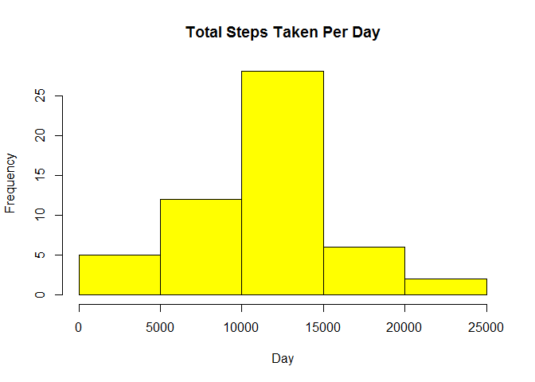
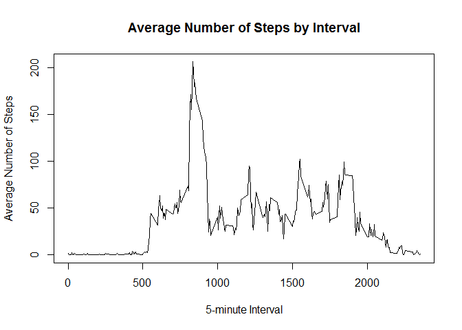
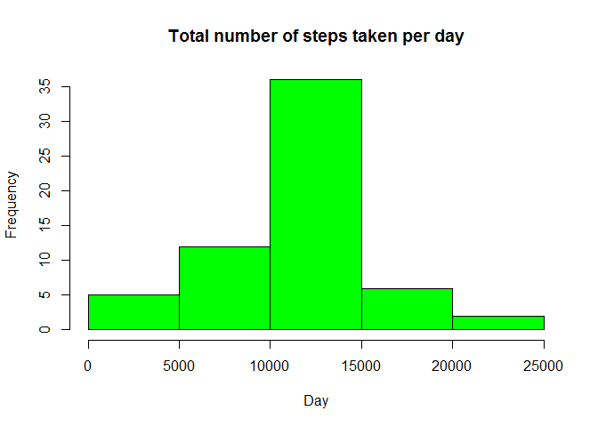
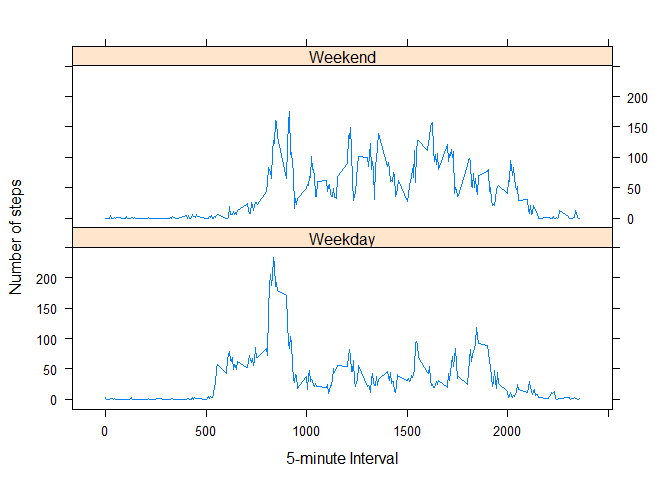

## Loading and preprocessing the data

Load the data from read.csv()


```r
echo=TRUE
library (knitr)
library(lattice)
activityData<-read.csv("activity.csv",colClasses=c("numeric","character","numeric"))

head(activityData)
```

```
##   steps       date interval
## 1    NA 2012-10-01        0
## 2    NA 2012-10-01        5
## 3    NA 2012-10-01       10
## 4    NA 2012-10-01       15
## 5    NA 2012-10-01       20
## 6    NA 2012-10-01       25
```
Process the date part of the data to prepare for further analysis

```r
activityData$date <- as.Date(activityData$date, "%Y-%m-%d")


str(activityData)
```

```
## 'data.frame':	17568 obs. of  3 variables:
##  $ steps   : num  NA NA NA NA NA NA NA NA NA NA ...
##  $ date    : Date, format: "2012-10-01" "2012-10-01" ...
##  $ interval: num  0 5 10 15 20 25 30 35 40 45 ...
```

## What is mean total number of steps taken per day?

Calculate the total number of steps for each day and depict using a histogram
Calculate the mean as well as median of the total number of steps taken per day over all the days

```r
totSteps<-aggregate(steps ~ date, data = activityData, sum, na.rm = TRUE)
head(totSteps)
```

```
##         date steps
## 1 2012-10-02   126
## 2 2012-10-03 11352
## 3 2012-10-04 12116
## 4 2012-10-05 13294
## 5 2012-10-06 15420
## 6 2012-10-07 11015
```

```r
hist(totSteps$steps, main = "Total Steps Taken Per Day", xlab = "Day",, col = "yellow")
```

 

```r
meanTotSteps<-mean(totSteps$steps)
medianTotSteps<-median(totSteps$steps)
```


Mean Total Number of Steps taken per day

```r
meanTotSteps
```

```
## [1] 10766.19
```
Median Total Number of Steps taken per day

```r
medianTotSteps   
```

```
## [1] 10765
```


## What is the average daily activity pattern?

Using aggregate as shown below seems to handle very well the long data gap that arises between the last interval of one hour and the first interval of the next hour.
Using tappy or other methods will replace the na with 0 whereas it is completely removed here.  

So, when using aggregate as below, the graph does not appear to have straight sloping hours at the end of every hour. This would be the case if tappy or other methods were used.

Calculate the average number of steps taken for each interval across all days
Plot a time series plot
Report the 5-minute interval with the max average steps per day


```r
meanStepsInterval<-aggregate(steps ~ interval, data = activityData, mean, na.rm = TRUE)

str(meanStepsInterval)
```

```
## 'data.frame':	288 obs. of  2 variables:
##  $ interval: num  0 5 10 15 20 25 30 35 40 45 ...
##  $ steps   : num  1.717 0.3396 0.1321 0.1509 0.0755 ...
```

```r
head(meanStepsInterval)
```

```
##   interval     steps
## 1        0 1.7169811
## 2        5 0.3396226
## 3       10 0.1320755
## 4       15 0.1509434
## 5       20 0.0754717
## 6       25 2.0943396
```

```r
plot(meanStepsInterval$interval,meanStepsInterval$steps, type="l", xlab="5-minute Interval", ylab="Average Number of Steps",main="Average Number of Steps by Interval")
```

 

```r
intervalMostAvgSteps <- meanStepsInterval[which.max(meanStepsInterval$steps),1]
```
The 5-minute interval with the maximum average steps per day :

```r
intervalMostAvgSteps
```

```
## [1] 835
```


## Imputing missing values

Calculate how many rows have values missing
Fill up the missing values with the average number of steps for each interval
Derive a new data set with these imputed/filled in values
Use this set to generate a histogram of the total number of steps taken each day

```r
howManyNa <- nrow(activityData[!complete.cases(activityData),])

print(sprintf("Number of rows with NA data: %i ", howManyNa))
```

```
## [1] "Number of rows with NA data: 2304 "
```

```r
meanStepsNanotremoved <- aggregate(steps ~ interval, data = activityData, FUN = mean)
imputNA <- numeric()
for (i in 1:nrow(activityData)) {
    rowVal <- activityData[i, ]
    if (is.na(rowVal$steps)) {
        steps <- subset(meanStepsNanotremoved, interval == rowVal$interval)$steps
    } else {
        steps <- rowVal$steps
    }
    imputNA <- c(imputNA, steps)
}

imputActivityData <- activityData
imputActivityData$steps <- imputNA
head(imputActivityData)
```

```
##       steps       date interval
## 1 1.7169811 2012-10-01        0
## 2 0.3396226 2012-10-01        5
## 3 0.1320755 2012-10-01       10
## 4 0.1509434 2012-10-01       15
## 5 0.0754717 2012-10-01       20
## 6 2.0943396 2012-10-01       25
```

```r
imputTotSteps <- aggregate(steps ~ date, data = imputActivityData, sum, na.rm = TRUE)
hist(imputTotSteps$steps, main = "Total number of steps taken per day", xlab = "Day", col = "green")
```

 

Calculate the new mean and median total number of steps taken per day
Determine if these differ from the first part of this assignment

Mean Total Number of steps taken per day : 


```r
mean(imputTotSteps$steps)
```

```
## [1] 10766.19
```

Median Total Number of steps taken per day : 

```r
median(imputTotSteps$steps)
```

```
## [1] 10766.19
```
With imputed values, there is no change in Mean, but some change in Median

```

## Are there differences in activity patterns between weekdays and weekends?

Create a new factor variable with "weekday" and "weekend" levels
Make a panel plot to compare the activity patterns between weekdays and weekends
Report on the difference observed


```r
#library(lubridate)

day <- weekdays(activityData$date)
daylevel <- vector()
for (i in 1:nrow(activityData)) 
{
    if (day[i] == "Saturday" | day[i] == "Sunday") 
    {
        daylevel[i] <- "Weekend"
    } 
    else 
    {
        daylevel[i] <- "Weekday"
    }
}
activityData$daylevel <- daylevel
activityData$daylevel <- factor(activityData$daylevel)

meanStepsByDay <- aggregate(steps ~ interval + daylevel, data = activityData, mean)
names(meanStepsByDay) <- c("interval", "daylevel", "steps")

xyplot(steps ~ interval | daylevel, meanStepsByDay, type = "l", layout = c(1, 2), 
    xlab = "5-minute Interval", ylab = "Number of steps")
```

 

Looking at the plots, there seems to be more activity during the weekends than weekdays!
